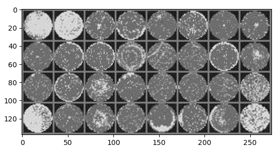

# Silicon Wafer Defect Detection

## NON-TECHNICAL EXPLANATION OF YOUR PROJECT
Manufacturing Silicon microchip is an expensive and very complex business. The Masks used to define the feature of components and wires cost 10s of millions of dollars to create. The manufacturing process needs constant monitoring to make sure it stays within expected parameters so, that the chip actually work. 

Quality control inspections of each silicon wafer is still largely done by humans visually inspecting wafers in a clean room. Which is both time consuming and expensive. This project is an attempt to proof the concept of a machine doing at least a first pass inspection of wafers so, that a human spends more time to investigating real issues with either the mask design or the manufacturing process.

## DATA
Finalized on the UCI-SEMCON dataset from this location:
http://mirlab.org/dataSet/public/
This is a set of images of silicon Wafers and a classification of 8 types of defects and a ‘None’ meaning a clean wafer with no defects. There are approximately 1000 images and I split them up into a 85% for training and 15% for test. I did try to find other images of silicon wafers that I could use as a test dataset, but I need them to be in a similar resolution and image size. Otherwise, the 15% test would have been a validation dataset. One disadvantage if this dataset is that even the clean images have some noise which the algorithm will need to handle.

Other dataset considered is the WM-811k wafer map dataset from this location:
https://www.kaggle.com/datasets/muhammedjunayed/wm811k-silicon-wafer-map-dataset-image

In this dataset the images have been converted into a Python Dataframe. There are some issues with this as the original images were  not captured in exactly the same manner each time. There are different resolutions and sizes of image. Making it difficult to use properly in the time I had. It is included for reference but not used in the final project.
 

## MODEL 
A summary of the model you’re using and why you chose it. 

## HYPERPARAMETER OPTIMSATION
Description of which hyperparameters you have and how you chose to optimise them. 

## RESULTS
Accuracy of the network on the test images: 85.29%
Correct: 116 Total: 136
                       precision    recall  f1-score   support

Centre                 0.81      0.87      0.84        15
Donut                  0.82      0.90      0.86        10
Edge Local             0.79      0.83      0.81        18
Edge Ring              0.87      0.93      0.90        14
Localized              0.93      0.72      0.81        18
Nearly Full            0.72      0.76      0.74        17
None                   1.00      0.89      0.94        18
Random                 1.00      1.00      1.00        11
Scratches              0.81      0.87      0.84        15

    accuracy                               0.85       136
 macro avg             0.86      0.86      0.86       136
weighted avg           0.86      0.85      0.85       136
 

You can include images of plots using the code below:

## (CONTACT DETAILS)
Email: antony_newbold@yahoo.com

