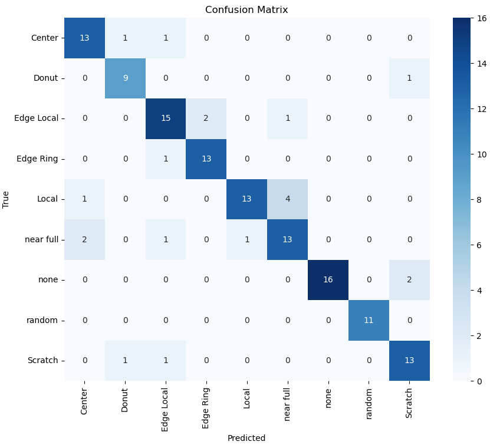

# Silicon Wafer Defect Detection

## NON-TECHNICAL EXPLANATION OF YOUR PROJECT
Manufacturing Silicon microchip is an expensive and very complex business. The Masks used to define the feature of components and wires cost 10s of millions of dollars to create. The manufacturing process needs constant monitoring to make sure it stays within expected parameters so, that the chip actually work. 

Quality control inspections of each silicon wafer is still largely done by humans visually inspecting wafers in a clean room. Which is both time consuming and expensive. This project is an attempt to proof the concept of a machine doing at least a first pass inspection of wafers so, that a human spends more time to investigating real issues with either the mask design or the manufacturing process.

## DATA
Finalized on the UCI-SEMCON dataset from this location:
http://mirlab.org/dataSet/public/
This is a set of images of silicon Wafers and a classification of 8 types of defects and a ‘None’ meaning a clean wafer with no defects. There are approximately 1000 images and I split them up into a 85% for training and 15% for test. I did try to find other images of silicon wafers that I could use as a test dataset, but I need them to be in a similar resolution and image size. Otherwise, the 15% test would have been a validation dataset. One disadvantage if this dataset is that even the clean images have some noise which the algorithm will need to handle. A second disadvantage of this dataset is that all the classifications are weighted equally. Meaning that there are about the same number of ‘Donut’ defects as there are ‘Clean‘ wafers. In real life you’d expect the number of clean wafers on a working manufacturing process to be a lot higher even than all the defects added together.

Other dataset considered is the WM-811k wafer map dataset from this location:
https://www.kaggle.com/datasets/muhammedjunayed/wm811k-silicon-wafer-map-dataset-image

In this dataset the images have been converted into a Python Dataframe. There are some issues with this as the original images were  not captured in exactly the same manner each time. There are different resolutions and sizes of image. Making it difficult to use properly in the time I had. It is included for reference but not used in the final project.
 

## MODEL 
Used a LeNet5 CNN model based on the work of Yann LeCun. Consisting of Convolutional, Pooling and Fully connected layers with ReLU activation functions. As this was a project using images I chose to use a CNN (Convolutional Neural Network for this project.
Input layer set to 32 to match resolution of the input images. A second Convolutional layer going up to 64 then a pooling layer then a further 2 convolutional layers. Then three fully connected layers. Details in the Jupyter notebook.

## HYPERPARAMETER OPTIMSATION
Took the original LeNet-5 architecture from a face recognition exercise from Imperial College course which quickly got up to 73% accuracy. Then found matching the resolution of the input images for the input layer, Adding a further convolutional layer improved the final result. Last thing in the LeNet-5 was the additional of the ReLU activation function to the pooling layer

Experimented with size of my LeNet-5 network. Started with Input layer either 32 or 64 and then doubling up on the neurons. I found that the smaller network worked better.

For training, I experimented with the SGD vs the Adam optimizer & Epochs. The SGD needed an Epoch of over 1500 to get close to converging and give a good result. However, the Adam only needed somewhere around 500 for Epoch. This was due to a much quicker convergence. However, it is a little sensitive

Batch size on the trainloader utility adjusted to 32 after trying 64 a instead of the original 4 from the face recognition code.

## RESULTS

Happy to get to over 85% accuracy. If more time spent I think it could go a little higher. Results on the training data were intially 99% and then move up to 100% if the changes decribed above.

## (CONTACT DETAILS)
Email: antony_newbold@yahoo.com

