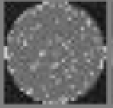
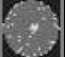
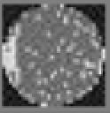
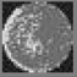
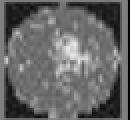
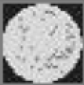
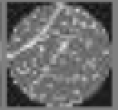

# Datasheet Template

## Motivation

The manufacturing of silicon microchip is a very expensive business requiring designs which cost 10s of millions of Dollars and very expensive to stop manufacturing processes. Mostly the Quality control is still performed by humans doing a visual inspect in a clean room. This is costly in time and therefore in cost. If a design fix is required, this will be an expensive change to the design or if there is an issue with the maintenance of any equipment on the production line could easily cause batches of wafers to be binned and manufacturing processes need constant 
The UCI-SECOM Dataset was created to be used for research purposes for proving the concept of using a Machine Learning vision system to perform a first pass visual inspection of Silicon Wafers coming off the manufacturing production line.

 
## Composition

The dataset is made up of a series of images of Silicon wafers coming of the manufacturing production line.

Example of each classification:

Clean: 
        Note that even though this image is marked as a clean image or defect free wafer. There is some noise that could make the classification difficult due to being interpreted as random damage.

Centre damage:
   Damage is located in the centre of the wafer.

Donut:
   Centre is relatively defect free but area around the centre but not extending right to the edge of the wafer is damaged.

Edge Localised: 
   Damage on the left side edge in this example

Edge Ring: 
   Similair to the previous classification but damage is extended further around the edge of the wafer. Typically, thinner than Edge-Local. Could be mis-interpreted as a scratch

Localised: 
   Damage is in one particular area. This particular example could easily be mis-interpreted as Centre damage.

Near Full Damage: 
  Pretty much covered in defects or damage form the manufacturing process. Possible that less pronounced example could be interpreted as some other classification.

Random Damage: 
  Defect all over the wafer. Not in a specific region. However, even though this is classified in the dataset a random there is a pattern here. This could suggest an issue with the manufacturing process causing this damage.

Scratched: 
      This example has two scratches. 

902 images of Silicon wafers. R32x 32 images resolution. Nine classifications in total. No recommended training/test data split. I settled on 85%-15%. Should look into splitting the dataset further into having a third verification dataset. I did end up using the test dataset a a verification dataset. Data of this type is not generally freely available due to commercial sensitivity of manufactures data. I search for additional images that I could use did not yield anything that I could have used as a true test dataset.

## Collection process

Images were collected by taking an image of the silicon wafer fresh of the manufacturing process. It is not published which process or manufacturer these images belong to.

Other datasets such as the WM-811k were taken in a variety of methods which make it more difficult to use in the time I had to produce a result. 

## Preprocessing/cleaning/labelling

Classifications of the images were already in place. No further preprocessing was required to use. Only to decide on batch size and training/testing dataset split.
 
## Uses

Only for proof of concept and educational purpures. To roll out a production version would require access to a manufacturers data and to have that data captured in the exact same manner for each image. Classifications are not fixed and could be amended to suit purposes.

## Distribution

Dataset is freely available from website referenced below. There is no license required or Terms of use or any other restrictions. Does not contain any confidential information for any manufacturer.

## Maintenance

Dataset is to be used as is. Has not been update in many years and not expected to be in the future. Age of data could be 7 years old at least.

