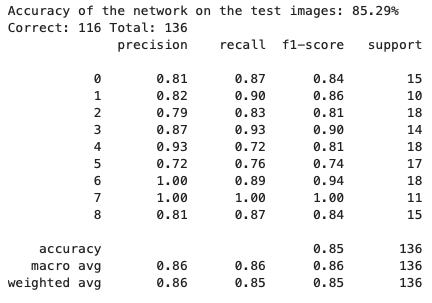
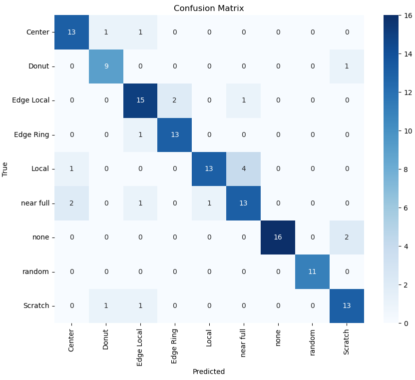

# Model Card

The manufacturing of silicon microchip is a very expensive business requiring designs which cost 10s of millions of dollars and very expensive to stop manufacturing processes if problems occur. Mostly the Quality control is still performed by humans doing a visual inspect in a clean room. This is costly in time and therefore in cost. If a design fix is required, this will be an expensive change to the design or if there is an issue with the maintenance of any equipment on the production line could easily cause batches of wafers to be binned and manufacturing processes need constant 

## Model Description
Used a LeNet5 CNN model based on the work of Yann LeCun. Consisting of Convolutional, Pooling and Fully connected layers with ReLU activation functions.
Input layer set to 32 to match resolution of the input images. A second Convolutional layer going up to 64 then a pooling layer then a further 2 convolutional layers. Then three fully connected layers. Details in the Jupyter notebook.

**Input:** A set of images taken after manufacture

**Output:** Nine classifications, See data_sheet.md for example images

**Model Architecture:** 
LeNet5(
  (conv1): Conv2d(1, 32, kernel_size=(3, 3), stride=(1, 1), padding=(1, 1))
  (conv2): Conv2d(32, 64, kernel_size=(3, 3), stride=(1, 1), padding=(1, 1))
  (pool): MaxPool2d(kernel_size=2, stride=2, padding=0, dilation=1, ceil_mode=False)
  (conv3): Conv2d(64, 128, kernel_size=(3, 3), stride=(1, 1), padding=(1, 1))
  (conv4): Conv2d(128, 256, kernel_size=(3, 3), stride=(1, 1), padding=(1, 1))
  (fc1): Linear(in_features=1024, out_features=512, bias=True)
  (dropout1): Dropout(p=0.5, inplace=False)
  (fc2): Linear(in_features=512, out_features=256, bias=True)
  (dropout2): Dropout(p=0.5, inplace=False)
  (fc3): Linear(in_features=256, out_features=9, bias=True)

## Performance

## Limitations

Need the images to be taken in the same and predictable mannor. Same resolution and image size

## Trade-offs

The SGD optimser used for training the LeNet took a long ie and needed a high Epoch number to get close. Settled on Adam optiser which converge more quickly and gave better results but require stopping at the right point to avoid a performance degradation 
